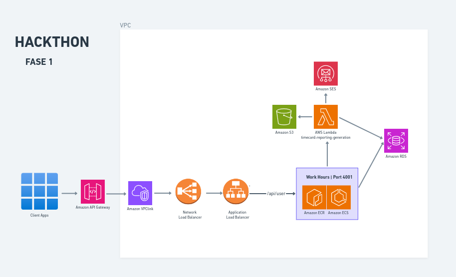
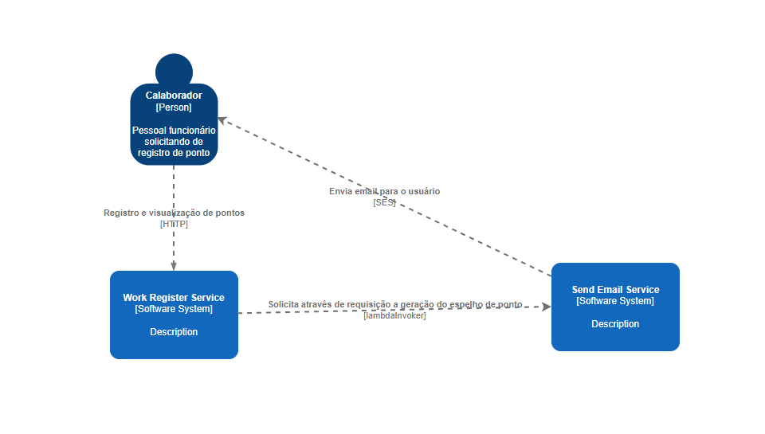
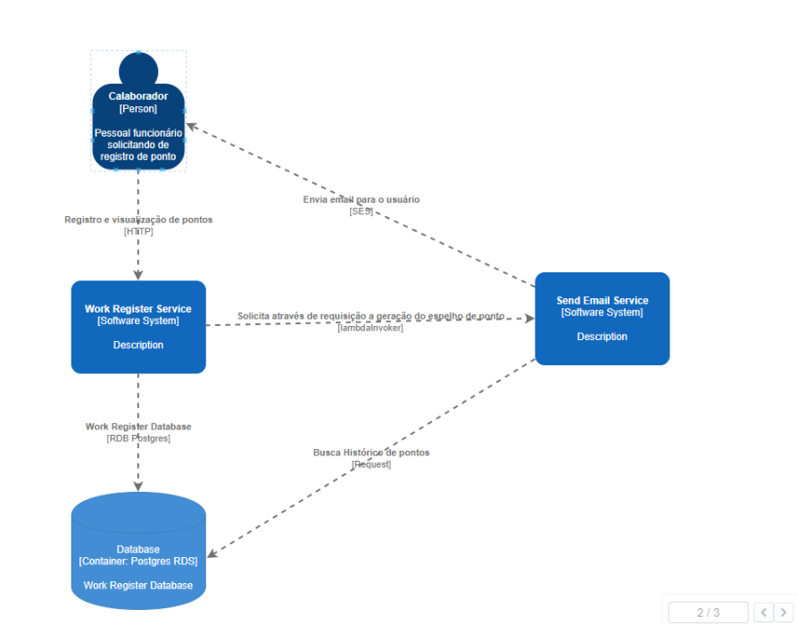
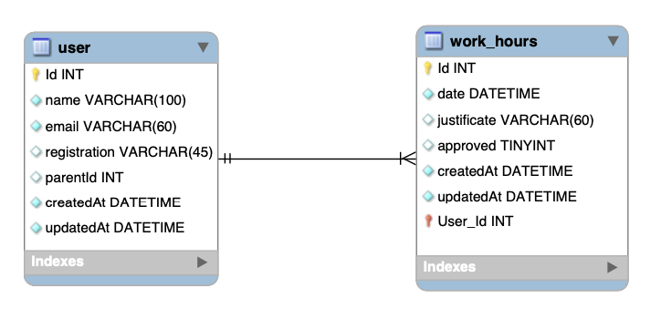
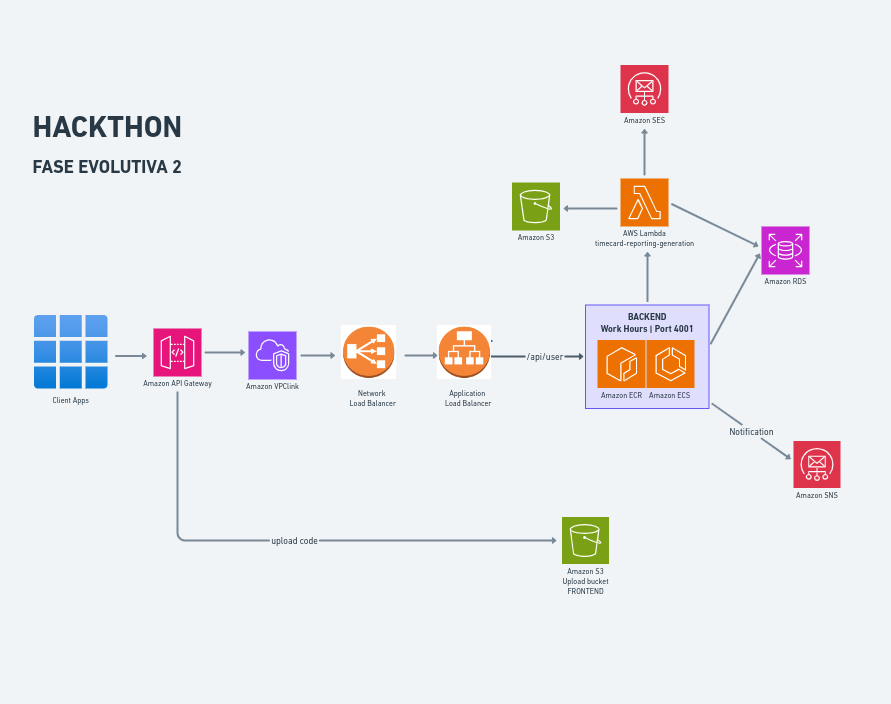
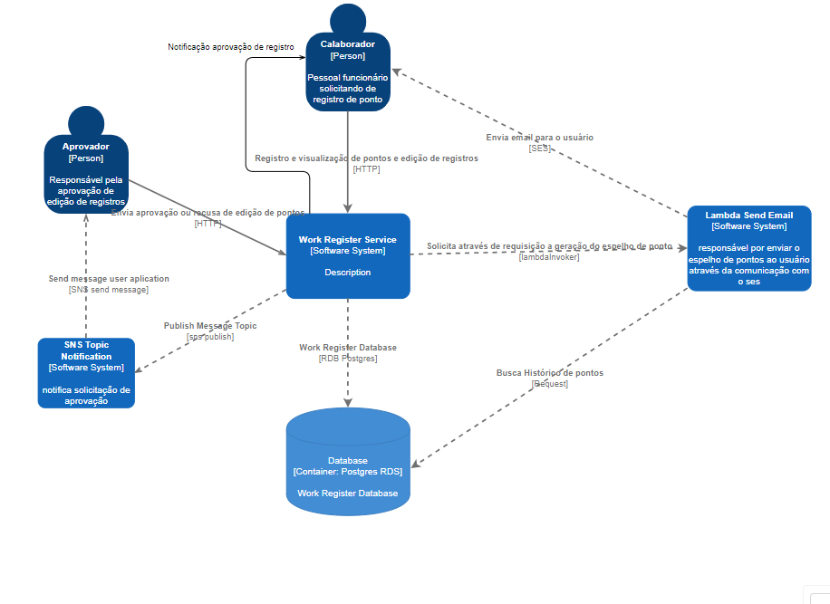

# 📚 Documentação HACKATON - Work Register Hours

## Vídeo
[**🔗Apresentação**](https://drive.google.com/drive/folders/10pmaCUWC3KSw5fhe7443c6w8qEAlEfVq?usp=sharing)

## Arquitetura 

## Contexto do Sistema

## Contexto do Container

## OWASP ZAP - Monitoramento de Segurança

[**🔗Work Register Hours**](./owasp/report.pdf) : Responsável por gerenciar os usuários e seus registros de ponto

----------------------------------------------------------------
### Database
-   Banco Postgres na instância do RDS

Principais pontos que consideramos para a escolha do banco de dados:

**Estruturação dos Dados**: O armazenamento de informações de ponto eletrônico geralmente envolve dados altamente estruturados, como registros de entrada e saída de funcionários, datas, horas, identificadores de funcionários, etc. O PostgreSQL é um banco de dados relacional altamente confiável e robusto que permite modelar e estruturar esses dados de forma eficiente.

**Integridade dos Dados**: A integridade dos dados é crucial em sistemas de ponto eletrônico para garantir a precisão dos registros de entrada e saída dos funcionários. O PostgreSQL suporta restrições de chave estrangeira, restrições de integridade referencial e outras funcionalidades que ajudam a garantir a consistência e a integridade dos dados.

**Desenvolvimento Flexível**: O PostgreSQL é conhecido por sua compatibilidade com SQL padrão e suporte a uma ampla gama de recursos avançados, como procedimentos armazenados, gatilhos, visões e funções. Isso oferece aos desenvolvedores flexibilidade para implementar lógica de negócios complexa diretamente no banco de dados, se necessário.

**Escalabilidade**: O Amazon RDS facilita a escalabilidade vertical e horizontal do seu banco de dados PostgreSQL. Você pode dimensionar verticalmente para instâncias maiores conforme suas necessidades de desempenho e capacidade de armazenamento aumentam. Além disso, você pode escalar horizontalmente distribuindo seus dados em várias réplicas de leitura ou usando recursos como o Amazon Aurora para escalabilidade ainda maior.

**Gerenciamento Simplificado**: O Amazon RDS gerencia tarefas administrativas rotineiras, como provisionamento de hardware, configuração de software, backup e recuperação de dados, monitoramento de desempenho e aplicação de patches de segurança. Isso permite que sua equipe de desenvolvimento se concentre mais no desenvolvimento de recursos e menos na manutenção do banco de dados.

**Segurança**: O PostgreSQL e o Amazon RDS oferecem recursos avançados de segurança para proteger seus dados, incluindo criptografia de dados em repouso e em trânsito, controle de acesso baseado em políticas, auditoria e monitoramento de atividades suspeitas.

Em resumo, o uso do Amazon RDS com PostgreSQL para salvar informações de ponto eletrônico oferece uma combinação de desempenho, confiabilidade, escalabilidade e segurança, além de simplificar o gerenciamento do banco de dados, permitindo que você se concentre em construir e melhorar seu sistema de ponto eletrônico.

----------------------------------------------------------------
### Repositório ECR
- name: ms-user

----------------------------------------------------------------
### ECS Fargate

Principais pontos que consideramos para a escolha do ECS Fargate:

**Escalabilidade Automática**: O ECS Fargate permite dimensionar automaticamente o número de contêineres da aplicação com base na demanda. Durante os picos de tráfego, o ECS Fargate pode provisionar rapidamente novos contêineres para lidar com o aumento da carga, garantindo que a aplicação permaneça responsiva e disponível para todos os funcionários.

**Isolamento de Recursos**: Cada contêiner no ECS Fargate é isolado, o que significa que recursos como CPU e memória são alocados individualmente para cada contêiner. Isso ajuda a evitar que um contêiner sobrecarregue outros contêineres na mesma instância, garantindo um desempenho consistente para todos os usuários, independentemente do número de funcionários registrando seus pontos eletrônicos.

**Facilidade de Implantação e Gerenciamento**: O ECS Fargate simplifica a implantação e o gerenciamento de contêineres, permitindo que a equipe de operações se concentre mais no desenvolvimento da aplicação e menos na infraestrutura subjacente. Novas versões da aplicação podem ser facilmente implantadas, atualizações podem ser realizadas de forma controlada e o desempenho da aplicação pode ser monitorado usando ferramentas integradas como o AWS CloudWatch.

**Eficiência de Custos**: O Fargate oferece uma estrutura de preços flexível, permitindo que a empresa pague apenas pelos recursos de computação consumidos pelos contêineres. Isso pode ser mais eficiente do que provisionar e gerenciar instâncias EC2 individuais, especialmente durante os períodos de pico de tráfego, onde a capacidade de computação adicional pode ser provisionada conforme necessário e desativada quando não estiver em uso.

**Integração com outros Serviços AWS**: O ECS Fargate se integra perfeitamente com outros serviços AWS, como Amazon RDS para armazenamento de dados, Amazon S3 para armazenamento de arquivos, AWS Lambda para execução de código sem servidor e Amazon API Gateway para exposição de APIs RESTful. Isso permite que a empresa construa uma arquitetura de aplicativo escalável e altamente disponível usando uma variedade de serviços gerenciados da AWS.

Em resumo, o uso do ECS Fargate para hospedar a aplicação de registro de ponto eletrônico oferece escalabilidade, isolamento de recursos, facilidade de implantação e gerenciamento, eficiência de custos e integração com outros serviços AWS, tornando-o uma escolha ideal para lidar com os requisitos de escala e desempenho da empresa.

----------------------------------------------------------------

### Api Gateway 
O API Gateway é utilizado para expor os serviços como APIs RESTful de forma segura e escalável

**Segurança**: Oferece recursos de autenticação e autorização para proteger as APIs.

**Escalabilidade**: Pode lidar com um grande volume de requisições de forma eficiente.

**Monitoramento**: Fornece métricas e logs detalhados para análise de desempenho e monitoramento.

**Customização**: Permite a personalização das respostas das APIs, adição de autorizadores, entre outros recursos.

----------------------------------------------------------------
### VPC Link
O VPC Link é utilizado para integrar o API Gateway com recursos dentro de uma rede privada.

**Segurança**: Permite que o tráfego da API Gateway seja direcionado para recursos dentro da VPC, mantendo a comunicação interna segura.

**Conectividade**: Facilita a integração com recursos internos da AWS, como Load Balancers e ECS, sem expô-los diretamente à internet.

**Escalabilidade**: Garante que as comunicações entre os serviços sejam escaláveis e confiáveis.

----------------------------------------------------------------
### Network Load Balancer
O NLB é utilizado para rotear o tráfego para diferentes serviços hospedados em diferentes instâncias ou contêineres.

**Alta Disponibilidade**: Oferece alta disponibilidade e confiabilidade ao distribuir o tráfego entre várias instâncias ou contêineres.

**Escalabilidade**: Pode lidar com um grande volume de tráfego e escalar automaticamente para atender à demanda.

**Desempenho**: Fornece baixa latência e alto desempenho ao rotear o tráfego de forma eficiente.

----------------------------------------------------------------
### Application Load Balancer (ALB):
O ALB é utilizado para rotear o tráfego HTTP/HTTPS entre diferentes serviços hospedados em contêineres ECS Fargate.

**Balanceamento de Carga**: Distribui o tráfego de forma inteligente entre os contêineres ECS, garantindo uma carga equilibrada.

**Roteamento Baseado em Regras**: Permite configurar regras de roteamento com base no conteúdo da requisição, permitindo cenários avançados de roteamento.

**Alta Disponibilidade**: Oferece alta disponibilidade e escalabilidade para os serviços hospedados em contêineres ECS Fargate.

Optamos por utilizar o NLB E O ALB juntos pelas seguintes razões:

**Escalabilidade e Performance**:
- O NLB é altamente escalável e é ideal para cargas de trabalho TCP/UDP de alto desempenho, como serviços de back-end que lidam com comunicação entre contêineres ou instâncias EC2.
- O ALB, por outro lado, é otimizado para cargas de trabalho HTTP/HTTPS e oferece recursos avançados de roteamento baseados em regras e balanceamento de carga. Ele é mais adequado para rotear o tráfego para serviços da web e APIs.

**Requisitos Específicos de Tráfego**:
- O NLB é mais adequado para cenários em que é necessário encaminhar o tráfego TCP/UDP de maneira eficiente e sem processamento adicional. Isso é ideal para aplicativos que exigem baixa latência e alto throughput.
- O ALB oferece recursos mais avançados, como roteamento baseado em conteúdo e suporte a WebSockets, que são úteis para aplicativos da web e APIs que precisam de recursos avançados de roteamento e manipulação de tráfego.

**Separação de Responsabilidades**:
- Utilizar o NLB para lidar com o tráfego entre contêineres ou instâncias EC2 permite separar essa funcionalidade específica e garantir que ela seja otimizada para esses tipos de cargas de trabalho.
- O ALB, por sua vez, pode lidar com o tráfego de entrada dos clientes, roteando-o para os diferentes serviços da aplicação de acordo com as regras de roteamento configuradas.

**Alta Disponibilidade e Redundância**:
- Ao utilizar ambos os load balancers, você pode criar uma arquitetura altamente disponível e redundante, distribuindo o tráfego entre diferentes tipos de serviços de forma eficiente e garantindo que o sistema como um todo seja resiliente a falhas.

O uso conjunto desses serviços permite criar uma arquitetura robusta, segura e escalável para expor APIs, integrar serviços internos em uma VPC e rotear o tráfego de forma eficiente entre os serviços hospedados em contêineres ECS Fargate. Cada serviço desempenha um papel específico na arquitetura, contribuindo para a segurança, escalabilidade e confiabilidade do sistema como um todo.

----------------------------------------------------------------
### SES:
Facilidade de Uso: Integrado à infraestrutura da AWS, o SES é simples de configurar e gerenciar para o envio de e-mails em grande escala.

**Escalabilidade**: Sendo altamente escalável, o SES pode lidar com volumes variados de e-mails, desde pequenas quantidades até bilhões de mensagens por mês, sem a necessidade de provisionamento prévio.

**Confiabilidade**: Como parte da infraestrutura da AWS, o SES apresenta alta confiabilidade, proporcionando uma taxa de entrega consistente e minimizando a possibilidade de e-mails serem marcados como spam ou não entregues.

**Segurança**: Implementando várias medidas de segurança, como autenticação de remetente e criptografia de dados, o SES protege a integridade dos e-mails enviados, tanto em trânsito quanto em repouso.

**Personalização e Automatização**: O SES permite a personalização de e-mails com base em dados do usuário e suporta o envio automático de mensagens em resposta a eventos específicos, por meio da integração com outros serviços AWS, como o Amazon S3, Amazon SNS e AWS Lambda.

**Economia de Custos**: Com uma estrutura de preços flexível, o SES cobra apenas pelo que é utilizado, o que pode resultar em custos mais baixos em comparação com outros serviços de envio de e-mail.

**Integração com Outros Serviços AWS**: Integrando-se perfeitamente com outros serviços da AWS, o SES possibilita a criação de fluxos de trabalho automatizados e altamente integrados para o envio e gerenciamento de e-mails em aplicativos hospedados na AWS.

Em resumo, o Amazon SES oferece uma solução confiável, escalável e segura para o envio de e-mails em grande escala, com uma variedade de recursos e integrações que o tornam uma escolha atraente para empresas de todos os tamanhos.

----------------------------------------------------------------
### S3:
A utilização do Amazon S3 (Simple Storage Service) em vez de salvar dados na memória da função Lambda apresenta várias vantagens:

**Persistência de Dados**: O S3 oferece uma solução de armazenamento durável e altamente disponível para seus dados. Ao salvar dados no S3, você garante que eles persistam mesmo após o término da execução da função Lambda.

**Escalabilidade**: O S3 é altamente escalável e pode lidar com grandes volumes de dados. Não há preocupações com limitações de tamanho de memória ou capacidade de armazenamento, como aconteceria ao armazenar na memória da Lambda.

**Eficiência de Recursos**: A memória da função Lambda é limitada e pode ser compartilhada entre várias execuções. Ao usar o S3, você evita o consumo excessivo de recursos de memória, permitindo que a função Lambda mantenha um desempenho consistente e previsível.

**Acesso a Longo Prazo**: O S3 é adequado para armazenar dados que precisam ser acessados a longo prazo, com opções de recuperação rápida quando necessário.

**Integração com Outros Serviços**: O S3 se integra facilmente a outros serviços da AWS, permitindo o processamento e análise de dados armazenados diretamente no S3. Isso facilita a construção de pipelines de dados e a implementação de arquiteturas serverless complexas.

**Segurança**: O S3 oferece recursos avançados de segurança, como criptografia de dados em repouso e em trânsito, controle de acesso baseado em políticas e monitoramento de atividades suspeitas.

**Economia de Custos**: O S3 oferece uma estrutura de preços flexível, com opções de armazenamento de baixo custo para dados pouco acessados e a capacidade de definir políticas de ciclo de vida para automatizar a transição de dados para classes de armazenamento mais econômicas.

O Amazon S3 para armazenar dados em vez de salvá-los na memória da função Lambda oferece uma solução mais escalável, durável, eficiente em termos de recursos e segura, adequada para uma variedade de cenários de aplicativos na nuvem.

----------------------------------------------------------------
### Lambda
Fazer o processamento do relatório na função Lambda oferece uma solução mais escalável, econômica, flexível, resiliente e integrada em comparação com a abordagem de processamento dentro do monolito. Isso permite construir sistemas mais eficientes, modularizados e adaptáveis às necessidades do negócio. A abordagem de processamento do relatório na Lambda faz parte de uma arquitetura serverless, onde a infraestrutura é gerenciada pela nuvem. Isso elimina a necessidade de provisionar, configurar e escalar servidores, permitindo que você se concentre exclusivamente na lógica do negócio. As funções Lambda são distribuídas e executadas em uma infraestrutura altamente disponível e resiliente. Isso garante que o processamento do relatório continue funcionando mesmo em caso de falhas em determinadas regiões ou instâncias.As funções Lambda se integram perfeitamente com outros serviços da AWS, como S3 para armazenamento de dados, DynamoDB para banco de dados NoSQL, e SNS para notificações. Isso facilita a construção de pipelines de processamento de relatórios completos e altamente automatizados.

## Arquitetura - Fase 2 Evolutiva

## Contexto do Container - Fase 2 Evolutiva

